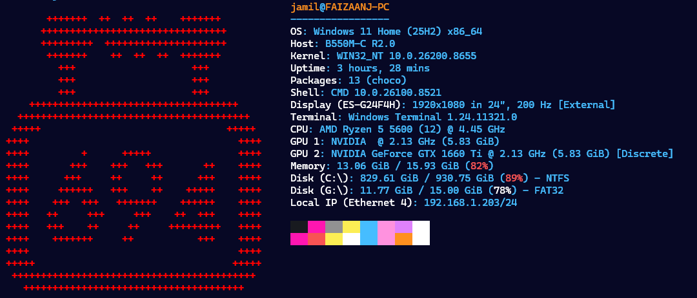

# Terminal Configs

These are my terminal larp configs, using [Fashfetch](https://github.com/fastfetch-cli/fastfetch).

## Credits
- Windows Terminal Themes for the [Retrowave](https://windowsterminalthemes.dev/?theme=Retrowave) theme.

---

- [asciiart.eu/image-to-ascii](https://www.asciiart.eu/image-to-ascii) for helping to convert images to ASCII art.
